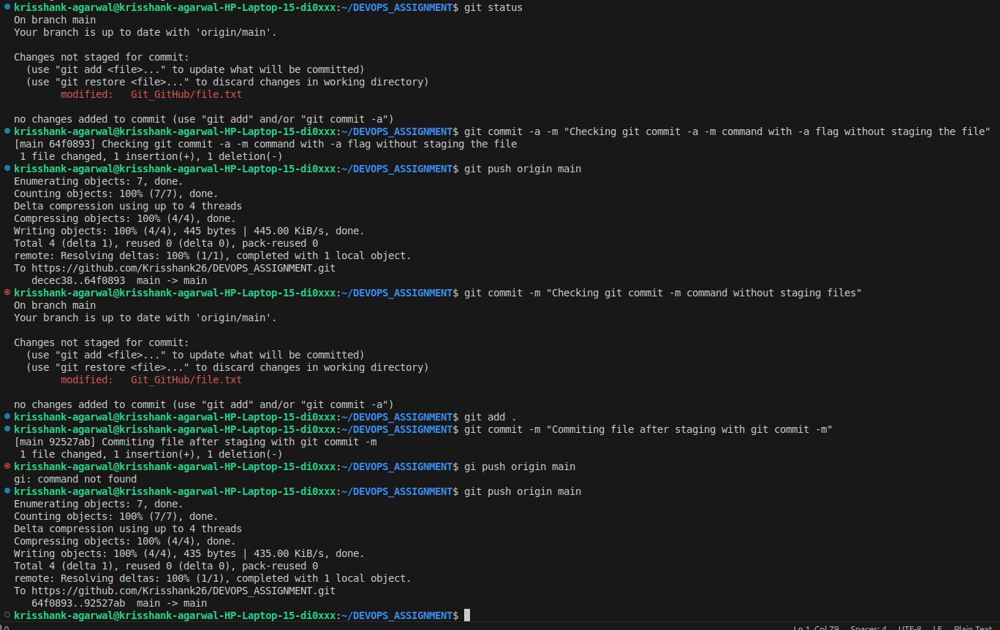
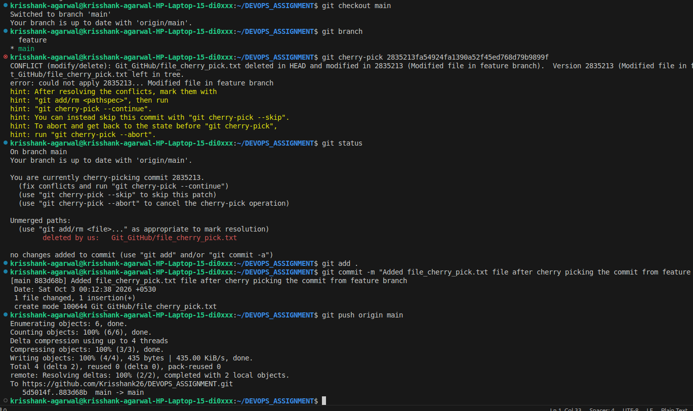

# Git/GitHub 

## 1. Difference between *git commit -a -m* and *git commit -m* 

*git commit -a -m:* With -a flag, the command stages all the modified and deleted files and commits them to the git, it does touch the newly added files. 

*git commit -m:* The command only commits the staged files and does not handle staging automatically by itself. 

 

## 2. Git Cherry-Pick 

 