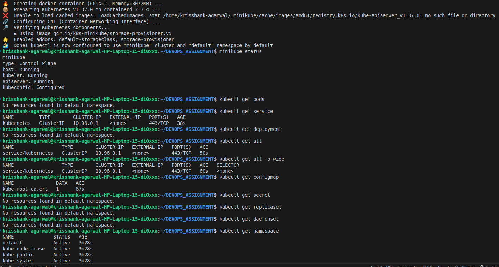

# Kubernetes Minikube commands 

# Kubernetes Architecture Overview 

Kubernetes follows a Master-Worker architecture. A cluster consists of a Control Plane (which manages the cluster) and one or more Worker Nodes (where your containerized applications actually run).

## 1. Control Plane (The Brain)
The control plane makes global decisions, maintains cluster state, and detects or responds to cluster events:

API Server: The front end of the control plane; exposes the Kubernetes API.

etcd: A reliable, distributed key-value store used as Kubernetes' backing store for all cluster data.

Scheduler: Watches for newly created pods with no assigned node and selects one for them to run on.

Controller Manager: Runs background control loops (like Node Controller and Replication Controller) to keep the cluster in the desired state.

## 2. Worker Nodes (The Muscle)
Worker nodes host the running applications and workloads:

Kubelet: An agent running on each node that ensures containers are running healthy inside a Pod.

Kube-proxy: Maintains network rules on nodes, enabling network communication to your Pods from inside or outside the cluster.

Container Runtime: The underlying engine responsible for pulling images and running containers (e.g., containerd, CRI-O).

## 3. Core Units
Pod: The smallest deployable computing unit in Kubernetes, typically holding one or more containers sharing storage and network resources. 

 