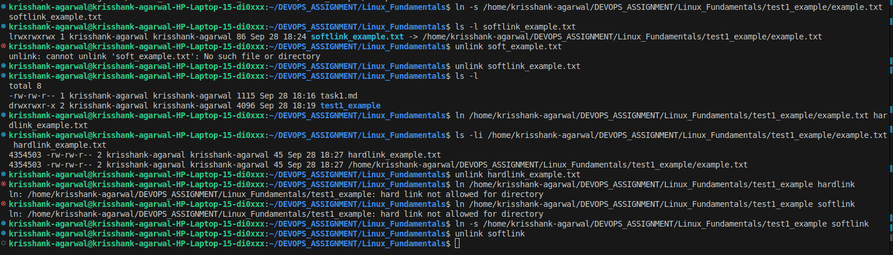
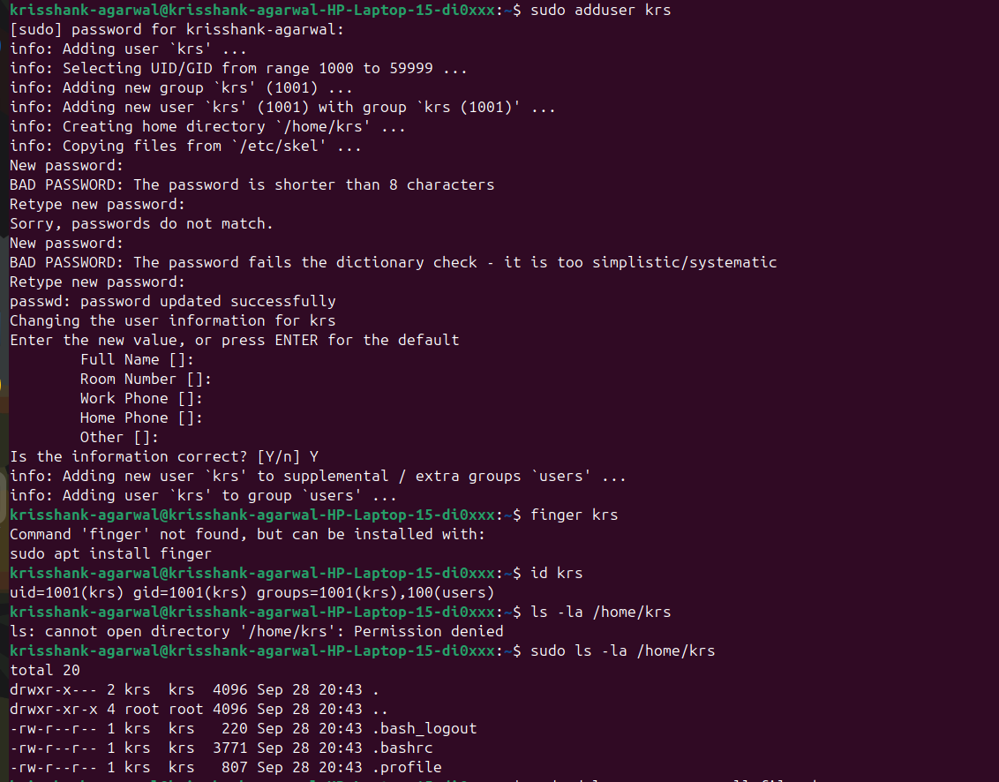
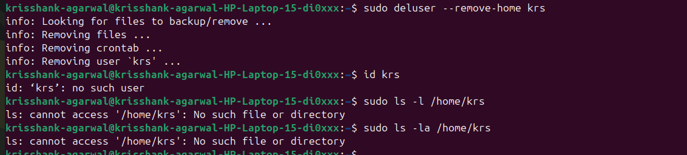

# Linux Fundamentals 

## Difference between Soft Link and Hard Link 

Soft Link- Soft link (or sumbolic links, symlinks ) is a special file in an Operating System that stores a text-based path pointer shortcut to another file in the system. It does not store the actual file contents of a file but only the path to it. Soft links can be applied to files as well as directories. If the original file is deleted then, the soft link becomes a "dangling pointer" to that file path, which does not exist now, and the actual contents are also deleted from the system. 

Hard link- Hard link is a direct pointer to the Inode Number of file in an Operating System. If accessing a file through hard link it will return the actual contents of the original file. Hard links can only be applied to files, because using them for directories can cause infinite recursive traversal in a file system, for example, you store the hard link of a parent folder in a child foler inside it. If the actual file is deleted, the contents of the file are not deleted and we can still access contents, if atleast one hard link to it exists. 

 

## Difference between useradd and adduser command 

useradd- useradd is a native, low- level binary compiled executable, that lets one create raw user profile. It requires -m flag to be created, it is not 
created automatically. Password mut be set manually using the passwd command. useradd is Universal in Linux and can be used under any Distribution. 

adduser- adduser is a high- level iteractive script (usually Perl or Bash ), that lets you create a user profile in guided steps. It does not require a flag and 
can be create through interactive TUI interface. It prompts you create a password during setup. adduser is dependent on the Distribution you use, for example, it is 
available on Debain, Ubuntu, but it is missing or only symlink to useradd on Distributions like Red Hat, Fedora. 

Which command is preferred in Ubuntu Linux Distribution and why? 

adduser command is preferred for Ubuntu Linux because it is user- friendly, and creates a user profile with guided instructions without any flags required with 
sudo adduser username 
It creates a profile automatically with home directory, copies skeleton config files (like .bashrc ), sets /bin/bash as default shell, and prompts you to set a 
password for the profile. adduser also respects system wide configuration files located at /etc/adduser.conf. This ensures that every human user created conforms to the 
exact same folder structure, UID/ GID, ranges and permissions. 
If you are writing automation scripts or using configuration management tools like Ansible or Puppet, then you should use useradd because it creates a profile directory 
with no home directory, password, and with a restricted shell like ./bin/sh, because of its non- interactive nature it will ensure that it does not pause for human- input. 

 
 