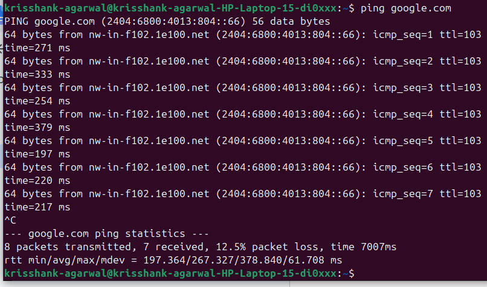
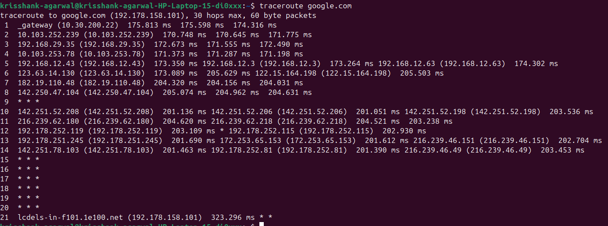
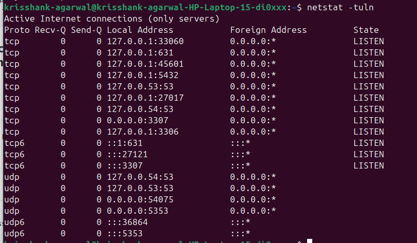
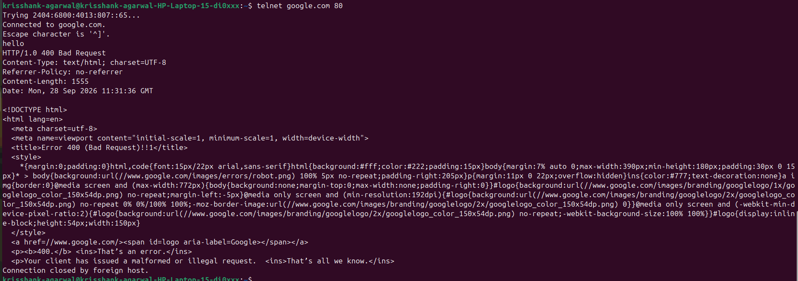

# Networking 

## 1. ping 

ping command tells if the connection to a particular device or server was successful or not, how much data was sent, received, time taken for each packet to be received, the icmp sequence number, and the overall statistics. 
 

## 2. traceroute 

traceroute command tells what route a particular packet takes to reach a particular destination, the amount of hops, which hops succeded and failed, and what was latency for each hop, and what their IP Addresses are. 
 

## 3. netstat 

netstat command tells what local ports are currently in use actively, what their state is, what Protocol they are connected through, and other statistics for troubleshooting network issues. 
 

## 4. telnet 

telnet command is used to establish a conection with a server or device at an IP Address at a particular Port Number, and states whether the connection was succesful or not or if it was timeout. It also provides an interactive interface where we can communicate with the connected device. 
 

## 5. dig 

dig command returns all the DNS Query data about a specific destination device like the public IP Addresses it is mapped to, the regions, the time taken to retrieve the data, the protocol used to retrieve the data. 
 